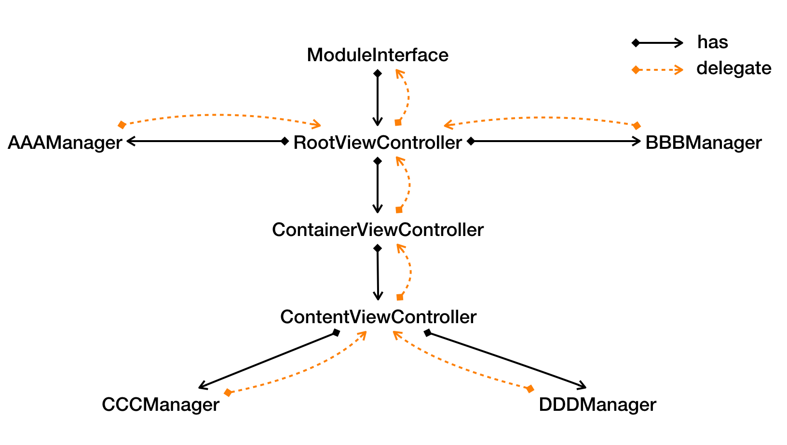

# Domino

[中文版](./README-CN.md)

Domino is a communication mechanism among multi-level objects for Objective-C.


## Why Use Domino?

When we implement complex UI, it is common to form a multi-level relationship, as shown below:



As the ContentViewController business grows, the delegates of ContentViewController/ContainerViewController/RootViewController will be biger and bigter. ContainerViewController/RootViewController may not care lots of events in those delegate. but it still needs to deliver these events to their superiors. Domino was  born to deal with this problem.


Domino creates an event chain among objects, just like responder chain.

##### Applicable scene:

- The parent VC contains the subvc. The subvc and the other subvc, and in turn.
- There are still many events maked by some managers separated from VC  that need to be delivered to the VC.
- Events in delegate (such as the UIScrollDelegate) need to be known more objects than one.

##### vs Delegate:

- Avoid methods implemented to forward messages.
- Delegate can only communicate one-to-one. But some events need to be known  more objects than one.
- Ignore namespace. (that is to say, events can be delivered directly across components)

##### vs Notification:

- Notification is not a good choice when there are multiple instances.

- Only the superior can receive events, which means management is stricter than notification.

  ​


## Getting Started with Domino

**There is a default event chain  along  responder chain of system.** You don't need to do any configuration if all related objects are on the same responder chain.

If not in the same response chain, you can mount an object to a chain in the following way:

```objective-c
[dddManager.domino mountAtDomino:contentVC.domino]
```

You can also unmount from  the previous node by using `unmountFromPredomino:`. The chain does NOT cause retain cycle, so you don't need to call `unmountFromPredomino` when object dealloc.

Domino Event contains `SimpleEvent` and `SelectorEvent`. **It is only delivered from bottom to up whichever event**.

#### SimpleEvent:

use `NSString` as event name and `NSDictionary` for storing parameters, just like `NSNotification`

#### SelectorEvent:

More like the delegate. SelectorEvent defined by protocols. Each method is a kind of SelectorEvent. It is easier and more formal to call method and pass parameters in this way. So in most cases, it is recommended to use SelectorEvent.

for selector event returning a value, event won't be delivered to next node once there is any one object handling the event. The mechanism is the same as the chain of responsibility.

for selector event  returning nothing, event will notify to every legal subscriber like a notification.


First you'd better create a new file to declare events.

```objective-c
// ContentViewControllerEvents.h

/// SimpleEvent
extern NSString * const ContentViewControllerStatisticsEvent;

/// SelectorEvent
@protocol ContentViewControllerEvents <NSObject>
@optional
- (void)contentDidLoadWithArg1:(NSString *)arg1 arg2:(NSInteger)arg2;
- (void)contentDidLoadWithArg:(NSInteger)arg;
- (NSString *)fetchChannelId;
@end
```


Post event:

```objc
#import "Domino.h"
#import "ContentViewControllerEvents.h"

@DominoSelectorEvents(ContentViewControllerEvents); // declare events would be posted
@interface ContentViewController ()

@end

@implementation ContentViewController

- (void)viewDidLoad {
    [super viewDidLoad];
    // ...
    
    // post SelectorEvent
  	[self.domino.trigger contentDidLoadWithArg:12];
  
    // post NormalEvent
    [self.domino.trigger postEvent:ContentViewControllerStatisticsEvent params:@{@"msg":@"did load"}];
  	
}
@end
```


Subscribe event:

```objective-c
#import "Domino.h"
#import "ContentViewControllerEvents.h"

@interface ContainerViewController () // <ContentViewControllerEvents> NOT neccessary
@end
@implementation ContainerViewController
- (void)viewDidLoad {
    [super viewDidLoad];
    [self.domino.tracker subscribeSelectorEvent:@selector(contentDidLoadWithArg:) target:self];
  
    [self.domino.tracker subscribeEvent:ContentViewControllerStatisticsEvent handler:^(NSDictionary *params) {
        NSLog(@"[%@]%@",ContentViewControllerStatisticsEvent, params);
    }];
}

- (void)contentDidLoadWithArg:(NSInteger)arg {
    NSLog(@"ContainerViewController - contentDidLoad %td",arg);
}
@end
```
Reform params for event:

```objective-c
@interface ContainerViewController ()<DominoInterceptor> // !!! declare IS neccessary !!!
@end
@implementation ContainerViewController
- (void)reformDominoParams:(DominoSelectorEventParams *)params forSelectorEvent:(SEL)selector {
    if (selector == @selector(contentDidLoadWithArg1:arg2:)) {
        NSLog(@"ContainerViewController - reform @selector(contentDidLoadWithArg1:arg2:)");
        params[0] = @"hook!!!"; // index from 0
        params[1] = @(333); // Don't worry about type
    }
}
@end
```
You can use `BOOL DominoProtocolContainSelector(Protocol *protocol, SEL selector);` to determine a selector whether belongs to the protocol, when you need to intercept some events in chain. This allows for all non-public events to be intercepted when necessary.

#### Thread:

Domino are safe-thread except `DominoSelectorEventParams`. Since most scenarios are UI events, **all subscriber will always be called on the main thread by default.** 

Of course, there are two other modes.

```ob
typedef NS_ENUM(NSInteger, DominoTriggerMode) {
    DominoTriggerModeMainThread,  // default
    DominoTriggerModeBackground,
    DominoTriggerModeCurrentThread,
};
```

You can change mode by `[Domino setTriggerMode:DominoTriggerModeBackground]`. Mode does NOT affect SelectorEvent which has a return value. and subscribers of this kind of event  will always be called in the thread where someone post this event.


## Installation

If you use Cocoapods, add `pod 'Domino', '~> 1.0.1'` to  your Podfile.

You can also add the two files `Domino.h/m` to your project. There are no further requirements.


## License

Domino is released under the MIT license. See [LICENSE](./LICENSE) for details.